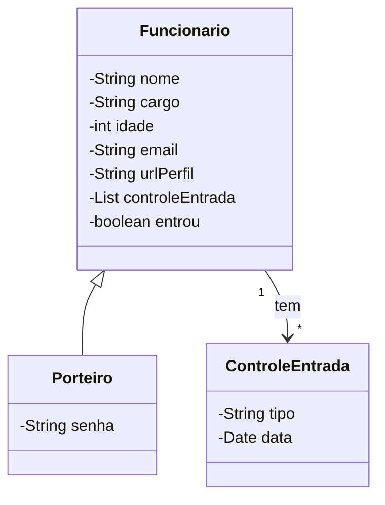

# PoltaliaEletlonica
Projeto feito para a disciplina de desenvolvimento web 2, se trata de uma simulador de portaria gerenciada por um porteiro, o nome PoltaliaEletlonica vem de portaria Eletrônica, só que desenvolvida por um desenvolvedor com língua presa.

## Instruções da atividade

"O sistema deve permitir o *cadastro de funcionários* da empresa.
Na portaria, deve haver uma *tela contendo cards clicáveis* contendo o nome de todos os funcionários que passam por aquela portaria. Assim que o funcionário chega para trabalho, o trabalhador responsável pela portaria deve *clicar no card contendo os dados do funcionário* que acabou de chegar. A ação do click deve enviar para o servidor uma requisição para que este *armazene a data e a hora* em que o click aconteceu.

No sistema deve haver uma *tela com todos os funcionários cadastrados*. O usuário pode *selecionar um funcionário* e esta seleção deve mostrar todos os registros feitos pela portaria para aquele funcionário."

repositório front end: [https://github.com/LucianoSegundo/PoltaliaEletlonica-Front-End](https://github.com/LucianoSegundo/PoltaliaEletlonica-Front-End)

repositório back end: [https://github.com/LucianoSegundo/PoltaliaEletlonica](https://github.com/LucianoSegundo/PoltaliaEletlonica)

## diagrama de classes.

